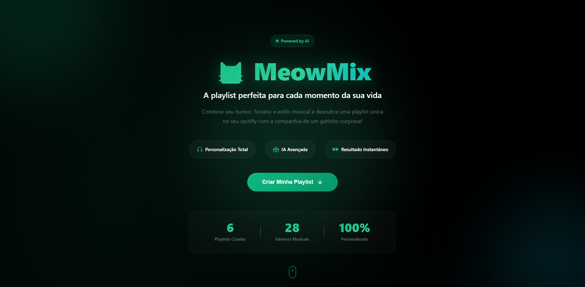
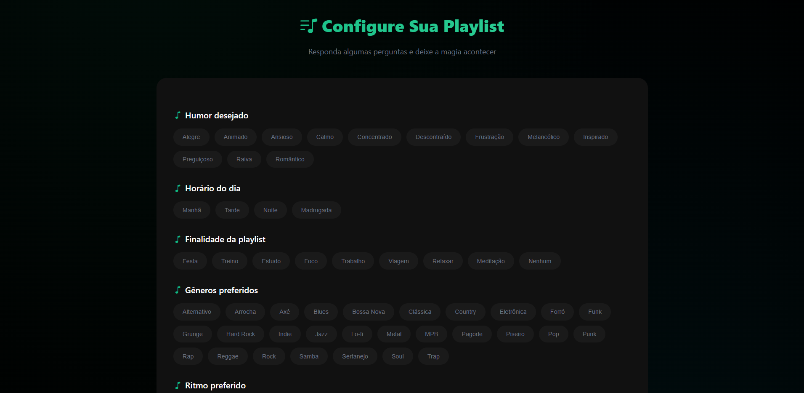
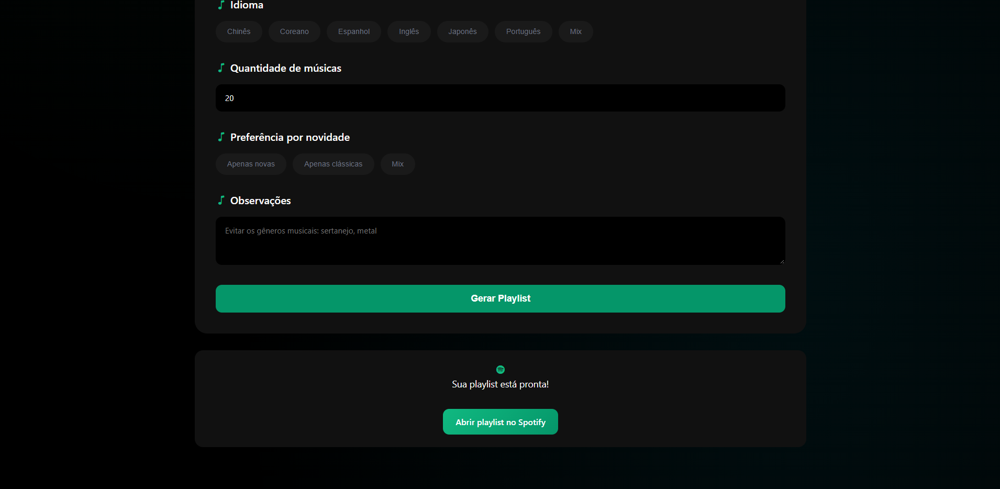
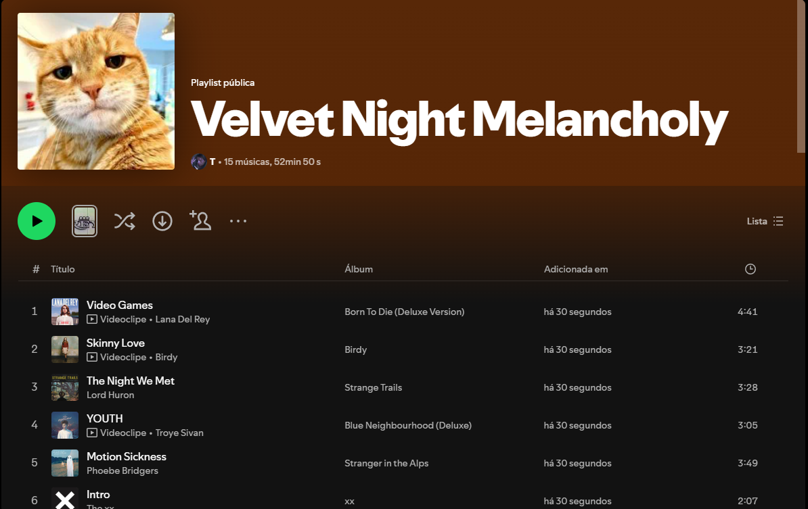

# MeowMix

> Playlists personalizadas do Spotify geradas por IA, com uma dose de fofura felina

MeowMix é uma aplicação full stack que cria **playlists personalizadas no Spotify** com base no humor, contexto e preferências do usuário. 
A geração das sugestões musicais é feita com **IA generativa (Google Gemini)**, enquanto a criação e gerenciamento das playlists utiliza a **Spotify Web API**.

<div align="center">
  <a src="(https://meow-mix.vercel.app/">
    
  </a>
</div>

## Funcionalidades

- **Personalização total**: Escolha humor, horário, finalidade, gêneros e mais
- **IA inteligente**: Sugestões musicais geradas pelo Google Gemini
- **Capas temáticas**: Cada playlist ganha uma capa única com gatinhos
- **Login seguro**: Autenticação OAuth 2.0 com Spotify
- **Criação instantânea**: Playlist pronta em segundos

  
## Como funciona 

<div align="center">
  
</div>

1. Usuário preenche o formulário com preferências musicais
3. Caso não esteja autenticado, é redirecionado para login no Spotify
4. Spotify redireciona de volta com tokens OAuth
5. Frontend envia preferências + tokens para o backend
6. Backend:
   * Obtém dados do usuário
   * Gera sugestões de playlist com IA
   * Cria playlist no Spotify
   * Adiciona músicas
   * Define capa personalizada
7. URL da playlist é retornada ao frontend
8. Com apenas um clique o usuário acessa sua nova playlist
   
<div align="center">
  
</div>

<div align="center">
  
</div>
   
## Tecnologias utilizadas

### Frontend

* React + Vite
* JavaScript (ES6+)
* CSS moderno
* Fetch API
* LocalStorage

### Backend

* Python 3.10+
* FastAPI
* Requests
* Pydantic para validação
* OAuth 2.0 para autenticação

### Integrações
- **Spotify Web API** - Criação e gerenciamento de playlists
- **Google Gemini API** - Geração inteligente de sugestões musicais
- **Cataas API** - Imagens temáticas de gatinhos para capas


## Deploy

- **Frontend**: [Vercel](https://vercel.com)
- **Backend**: [Render](https://render.com)

## Estrutura do projeto

```
meow-mix/
│
├── backend/
│   ├── main.py                # Aplicação FastAPI
│   ├── services/
│   │   ├── spotify.py         # Integração com Spotify API
│   │   └── gemini.py          # Integração com IA (Gemini)
│   └── requirements.txt
│
├── frontend/
│   ├── src/
│   │   ├── components/
│   │   │   ├── Form.jsx
│   │   │   └── ChipGroup.jsx
│   │   ├── App.jsx
│   │   └── main.jsx
│   └── index.html
│
└── README.md
```


## Personalização da IA

A Inteligência Artificial considera múltiplos fatores para criar a playlist perfeita:

| Categoria | Opções |
|-----------|---------|
| **Humor** | Alegre, Animado, Ansioso, Calmo, Concentrado, etc. |
| **Horário** | Manhã, Tarde, Noite, Madrugada |
| **Finalidade** | Festa, Treino, Estudo, Foco, Trabalho, Relaxar, etc. |
| **Gêneros** | 28 gêneros incluindo Pop, Rock, MPB, Sertanejo, Eletrônica, etc. |
| **Ritmo** | Lento, Moderado, Rápido |
| **Idioma** | Português, Inglês, Espanhol, Coreano, Japonês, Chinês, Mix |
| **Novidade** | Apenas novas, Apenas clássicas, Mix |

A resposta da IA inclui:

* Nome da playlist
* Tag temática (usada na capa)
* Lista de músicas (título + artista)


## Capa da playlist

A capa da playlist é definida automaticamente:

1. Uma imagem temática é baixada da API **Cataas**
2. A imagem é convertida para Base64
3. A imagem é enviada para o Spotify via endpoint:


<div align="center">
  
</div>

## Caso opte por executar localmente

#### Pré-requisitos
- Python 3.10+
- Node.js 16+
- Conta de desenvolvedor no Spotify
- API Key do Google Gemini

#### Backend

```bash
cd backend
python -m venv venv
source venv/bin/activate  # Linux/Mac
venv\Scripts\activate     # Windows

pip install -r requirements.txt
uvicorn main:app --reload
```

Backend disponível em:

```
http://127.0.0.1:8000
```

#### Frontend

```bash
cd frontend
npm install
npm run dev
```

Frontend disponível em:

```
http://localhost:5173
```
